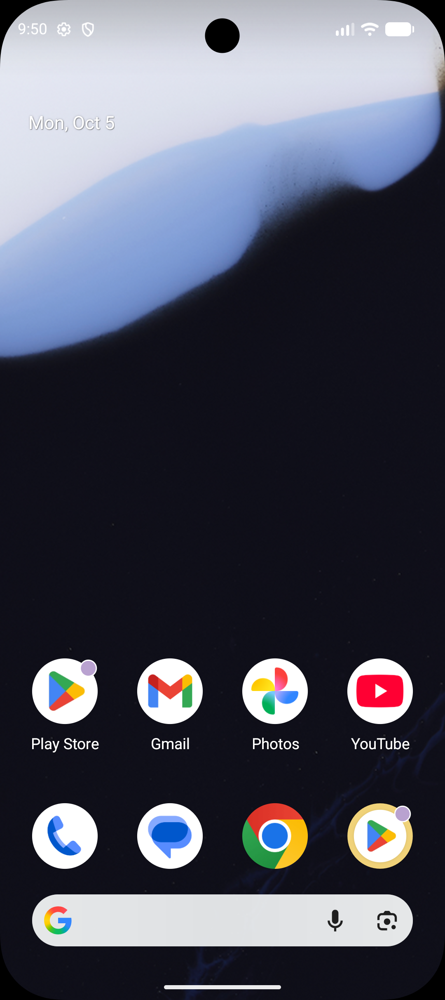
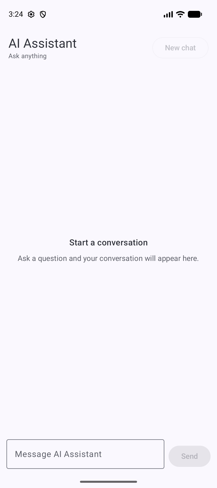
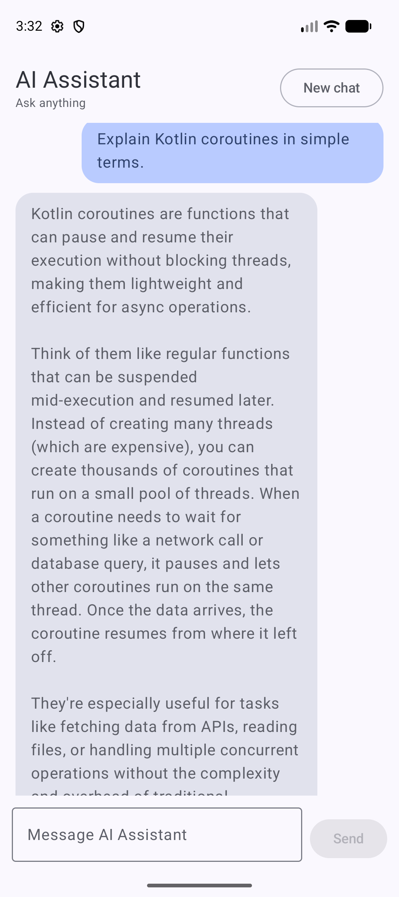
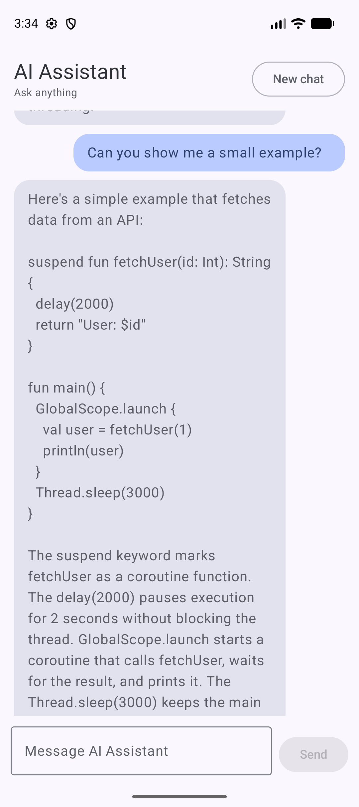

# Android AI Assistant

Native Android conversational AI assistant built with **Kotlin, Jetpack Compose, ViewModel, StateFlow, Room, Retrofit/OkHttp, FastAPI, and Anthropic Claude**.

<p align="center">
  
</p>

## Highlights

- True multi-turn conversation with ordered user/assistant history
- Recent-context window capped at the latest 11 messages
- Room-backed persistence and restoration after app restart
- ViewModel + StateFlow for lifecycle-aware UI state
- Retrofit + OkHttp networking with explicit timeouts and error mapping
- Coroutine cancellation propagation and duplicate-send protection
- FastAPI backend with validation, request IDs, latency metadata, and Anthropic integration
- AI provider credentials kept on the backend rather than in the Android client

## App Screens

<p align="center">
  
  &nbsp;&nbsp;
  
  &nbsp;&nbsp;
  
</p>

<p align="center">
  <sub>Empty state • AI response • Multi-turn contextual follow-up</sub>
</p>

## Architecture

```text
Jetpack Compose
    ↓
AssistantViewModel / StateFlow
    ↓
MessageRepository
    ↓
Retrofit + OkHttp
    ↓
FastAPI
    ↓
Anthropic Claude

AssistantViewModel
    ↓
MessageHistoryStore
    ↓
Room / SQLite
```

## Demo Flow

1. Ask: **"Explain Kotlin coroutines in simple terms."**
2. Follow with: **"Can you show me a small example?"** without repeating the topic.
3. The second answer uses the previous conversation, demonstrating multi-turn context.
4. Reopen the app to show Room-backed conversation restoration.
5. **New chat** clears the visible state and persisted history.

## Project

**[Open the full Mobile AI Assistant project →](mobile-ai-assistant/)**

The project folder contains the Android client, FastAPI backend, tests, architecture notes, screenshots, and a detailed technical README.

## Current Scope

This is a portfolio/local-development project. It does not claim production deployment, offline LLM inference, streaming responses, authentication, or measured performance/battery improvements.
