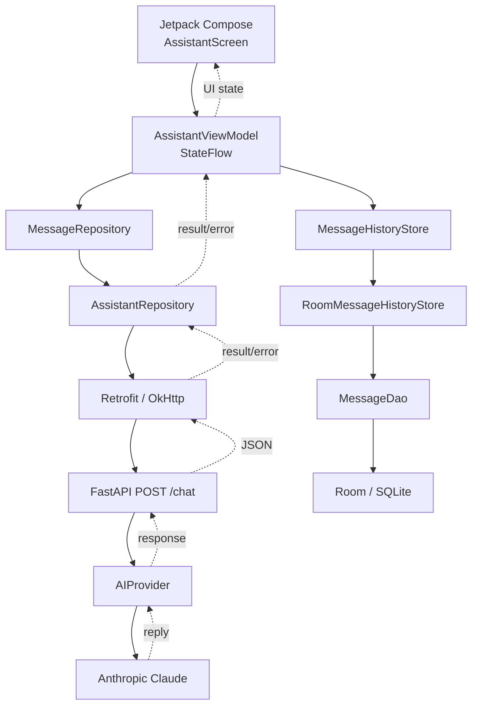

# Mobile AI Assistant

## Overview

A native Android conversational AI assistant built with **Kotlin, Jetpack Compose, ViewModel, StateFlow, Room, Retrofit, FastAPI, and Anthropic Claude**.

The project started as a simple one-shot prompt/response client and was upgraded into a real multi-turn conversational app with persistent local history, bounded model context, lifecycle-aware state handling, cancellation support, and user-friendly network error handling.

```text
Android app
  → AssistantViewModel / StateFlow
  → MessageRepository
  → Retrofit + OkHttp
  → FastAPI
  → Anthropic Claude

AssistantViewModel
  → MessageHistoryStore
  → Room
  → SQLite
```

The Anthropic API key is **never stored in the Android app**. The client only talks to the FastAPI backend; the backend owns the provider credential and AI integration.

## Demo

<p align="center">
  
</p>

<p align="center">
  <b>Native Android conversational AI assistant with multi-turn context and Room persistence.</b>
</p>

### App Screens

<p align="center">
  
  &nbsp;&nbsp;
  
  &nbsp;&nbsp;
  
</p>

<p align="center">
  <sub>Empty state • Claude response • Multi-turn contextual follow-up</sub>
</p>

## Key Features

- **True multi-turn conversation** with ordered user/assistant message history.
- **Bounded AI context**: only the newest 11 messages are sent to the backend/model.
- **Persistent conversation history** using Room.
- **Process-restart restoration**: persisted messages are reloaded into a newly created ViewModel.
- **New chat** clears both in-memory UI state and persisted Room history.
- **Jetpack Compose chat UI** with user/assistant bubbles, loading state, conditional auto-scroll, and lifecycle-aware collection.
- **ViewModel + StateFlow** as the screen's single source of truth.
- **Coroutine cancellation propagation** so cancellation is not misreported as a network failure.
- **Duplicate-send protection** while a request is active.
- **Retrofit + OkHttp** with explicit network timeouts.
- **FastAPI backend** with Pydantic validation, request IDs, structured logging, and provider abstraction.
- **Server-side Anthropic integration** with the API key kept out of the APK.
- **Configurable backend URL** through BuildConfig/local.properties for local development.

## Android Architecture



## Conversation Model and UI State

Each message is represented as:

```kotlin
enum class MessageRole {
    USER,
    ASSISTANT
}

data class ChatMessage(
    val id: String,
    val role: MessageRole,
    val content: String
)
```

The screen state is:

```kotlin
data class AssistantUiState(
    val input: String = "",
    val messages: List<ChatMessage> = emptyList(),
    val isLoading: Boolean = false,
    val error: String? = null
)
```

`AssistantViewModel` owns a `MutableStateFlow<AssistantUiState>` and exposes it as read-only `StateFlow`. Compose collects it with `collectAsStateWithLifecycle()`.

The UI uses a `LazyColumn` with stable message IDs, right-aligned user bubbles, left-aligned assistant bubbles, a "Thinking..." loading bubble, and a **New chat** action.

## Multi-Turn Context

When the user sends a message, the ViewModel builds:

```text
existing conversation + new user message
```

and passes that ordered list to `MessageRepository.sendMessages(...)`.

The repository maps domain messages into API DTOs and deliberately limits model context:

```kotlin
messages.takeLast(11)
```

This prevents request size and token usage from growing indefinitely while preserving recent conversational context.

Example:

```text
USER: Explain Kotlin coroutines in simple terms.
ASSISTANT: ...
USER: Can you show me a small example?
```

The second request includes the previous turn, so Claude understands that "example" refers to Kotlin coroutines without the user repeating the topic.

## Room Persistence

The app persists one active conversation locally.

Main persistence components:

- `MessageEntity` — Room representation of a message.
- `MessageDao` — load, insert, and clear operations.
- `AppDatabase` — Room database singleton.
- `MessageHistoryStore` — persistence abstraction used by the ViewModel.
- `RoomMessageHistoryStore` — production Room-backed implementation.
- `NoOpMessageHistoryStore` — lightweight default/test implementation.
- `AssistantViewModelFactory` — injects the Room-backed history store into the production ViewModel.

### Restore flow

```text
App/process starts
→ new AssistantViewModel
→ historyStore.loadMessages()
→ persisted messages loaded from Room
→ StateFlow updated
→ Compose renders restored conversation
```

### Send flow

```text
User taps Send
→ user message added to UI
→ user message persisted
→ conversation sent to backend
→ assistant reply received
→ assistant message added to UI
→ assistant message persisted
```

### New chat flow

```text
New chat
→ cancel active restore/send work
→ reset AssistantUiState
→ clear persisted Room messages
```

The Room implementation was manually verified by sending a conversation, force-stopping the app, reopening it, and confirming the messages were restored. Clearing the conversation and reopening the app was also verified.

## Lifecycle Behavior

- **Recomposition:** state remains in the ViewModel; Compose simply re-reads the latest StateFlow value.
- **Configuration change:** the ViewModel survives normal Activity recreation, so current state and `viewModelScope` work can continue.
- **Process death / full restart:** the old ViewModel is destroyed, but persisted conversation messages can be restored from Room into the new ViewModel.

The project does **not** claim that ViewModel itself survives process death.

## Networking

`AssistantRepository` sends the bounded conversation through Retrofit.

The backend URL comes from:

```kotlin
BuildConfig.BACKEND_BASE_URL
```

with a development fallback of:

```text
http://10.0.2.2:8000/
```

A local `local.properties` override can point the emulator at a different development port, for example:

```text
AI_BACKEND_URL=http://10.0.2.2:8010/
```

`10.0.2.2` is the Android emulator alias for the host machine's loopback interface.

OkHttp timeouts:

- connect: 10 seconds
- read: 30 seconds
- write: 10 seconds

## Error Handling and Cancellation

The repository maps technical failures to concise user-facing messages:

| Failure | Behavior |
|---|---|
| Timeout | "The request took too long. Please try again." |
| Connectivity / IO | "Unable to connect. Check your network and try again." |
| HTTP 5xx | "The AI service is temporarily unavailable. Please try again." |
| Other HTTP error | "Something went wrong. Please try again." |
| Invalid JSON | "Received an invalid response. Please try again." |

Coroutine cancellation is handled separately:

```kotlin
catch (e: CancellationException) {
    throw e
}
```

This matters because cancellation is a control-flow signal, not a normal network failure.

The app also avoids blind automatic retries for `POST /chat`. A timeout may be ambiguous: the backend/provider could already have processed the request, so an automatic retry could duplicate paid AI work.

## Backend API

The FastAPI backend accepts ordered conversation history:

```json
{
  "messages": [
    {
      "role": "user",
      "content": "Explain Kotlin coroutines."
    },
    {
      "role": "assistant",
      "content": "..."
    },
    {
      "role": "user",
      "content": "Show me an example."
    }
  ]
}
```

Validation rules include:

- at least 1 message
- at most 11 messages
- role must be `user` or `assistant`
- message content cannot be blank
- latest message must have role `user`

The response contains:

```json
{
  "response": "...",
  "request_id": "...",
  "latency_ms": 123
}
```

`latency_ms` is backend/provider-call timing. It is not presented as a phone end-to-end performance benchmark.

## AI Provider Layer

The backend uses an `AIProvider` abstraction.

Implementations include:

- `AnthropicProvider` — production integration using `anthropic.AsyncAnthropic`
- `MockProvider` — deterministic provider used by tests

The Anthropic provider uses:

- model: `claude-haiku-4-5-20251001`
- `max_tokens=512`
- 30-second provider timeout
- a server-side system prompt tuned for concise mobile responses

The API key is read from:

```text
ANTHROPIC_API_KEY
```

on the backend only.

## Testing and Verification

The project includes Android JVM tests covering areas such as:

- ViewModel state updates
- successful and failed sends
- duplicate-send behavior
- cancellation / clear behavior
- multi-turn request construction
- repository message ordering and role mapping
- newest-11-message truncation
- network error mapping

Backend pytest coverage includes:

- valid multi-turn requests
- blank/invalid messages
- context-size validation
- latest-message role validation
- provider success/failure behavior
- request logging

The backend suite was verified with **10 passing tests** after the multi-turn upgrade.

Manual verification also covered:

1. Real multi-turn follow-up behavior against Claude.
2. Room conversation restoration after force-stop/reopen.
3. Persisted clearing after **New chat**.

## Security

- Anthropic credentials remain backend-only.
- No Anthropic API key is embedded in Kotlin, Gradle, Android resources, or the APK.
- Local cleartext networking is restricted to development/emulator use.
- A production deployment would require an HTTPS backend and authentication.
- Backend logging uses metadata such as request ID, provider, status, and latency rather than intentionally logging prompt/response contents.

## Current Limitations

- One active persisted conversation; there is no multi-conversation history screen.
- No streaming token-by-token responses.
- No on-device/offline LLM.
- No authentication/authorization between client and backend.
- Backend is currently a local development service rather than a production deployment.
- No Room migration path has been needed yet because the current schema is version 1.
- A failed cloud request can leave the persisted user message without a matching assistant response. A production improvement would model turn state such as `PENDING`, `COMPLETED`, and `FAILED`, and avoid using unresolved turns in future model context.
- Context management is simple recent-message truncation, not summarization or token-aware compression.

## Repository Structure

```text
mobile-ai-assistant/
├── android/
│   └── app/src/
│       ├── main/java/com/sai/mobileaiassistant/
│       │   ├── MainActivity.kt
│       │   ├── AssistantViewModel.kt
│       │   ├── AssistantViewModelFactory.kt
│       │   ├── AssistantUiState.kt
│       │   ├── ChatMessage.kt
│       │   └── data/
│       │       ├── MessageRepository.kt
│       │       ├── AssistantRepository.kt
│       │       ├── local/
│       │       │   ├── AppDatabase.kt
│       │       │   ├── MessageDao.kt
│       │       │   ├── MessageEntity.kt
│       │       │   └── MessageHistoryStore.kt
│       │       └── remote/
│       │           ├── ApiService.kt
│       │           ├── RetrofitClient.kt
│       │           └── model/
│       └── test/
├── backend/
│   ├── app/
│   │   ├── main.py
│   │   └── providers.py
│   └── tests/
└── docs/
    ├── architecture.md
    ├── interview-notes.md
    └── screenshots/
```

## Running Locally

### Backend

From `backend/`:

```bash
python3 -m venv .venv
source .venv/bin/activate
pip install -r requirements.txt

export ANTHROPIC_API_KEY="your-key"
uvicorn app.main:app --reload --port 8010
```

Do not commit a real API key.

### Android

For a backend running on port 8010, add this to the ignored `android/local.properties`:

```text
AI_BACKEND_URL=http://10.0.2.2:8010/
```

Then:

```bash
cd android
./gradlew installDebug
./gradlew testDebugUnitTest
```

## Interview Summary

A concise way to describe the project:

> I built a native Android conversational AI assistant using Kotlin and Jetpack Compose. The UI state is managed with ViewModel and StateFlow, and Retrofit sends a bounded multi-turn conversation to a FastAPI backend that integrates with Claude. I added Room persistence so the active conversation can be restored after process restart, and I also handled cancellation, duplicate sends, network error mapping, and kept the Anthropic API key entirely on the backend.
